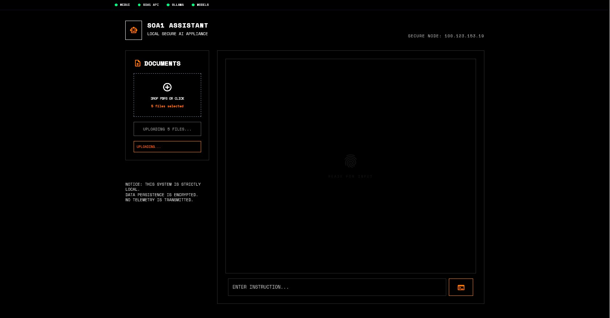

# SOA1: Son of Anton (Local Home AI)



SOA1 is a strictly local, privacy-first home AI assistant designed to run on consumer hardware without any cloud dependencies. It provides a conversational interface for household management, specializing in high-accuracy financial analysis and document processing.

## 🚀 Core Features

### 🧠 Intelligent Orchestration
- **Conversational Assistant**: Powered by `NemoAgent`, providing context-aware responses and intent detection.
- **Progressive Engagement**: Acknowledges document uploads immediately with metadata summaries while processing full analysis in the background.
- **Situational Awareness**: The orchestrator tracks current task states, batch progress, and preliminary findings to keep the user informed.

### 📊 Financial Intelligence Pipeline
- **Hybrid Calculation Engine**: Combines pure Python math (100% accuracy) with LLM-driven qualitative insights.
- **Multi-File Batch Processing**: Upload and analyze multiple bank or credit card statements (e.g., Apple Card) simultaneously.
- **Automated Categorization**: Robust regex-based extraction coupled with LLM-assisted merchant normalization and category mapping.
- **Merchant Stable IDs**: Graph-safe linkage using SHA-256 hashes to ensure merchant history remains consistent across dictionary updates.

### 📈 Visual Dashboards & Reporting
- **Interactive Web UI**: A brutalist, dark-themed dashboard featuring real-time chat and financial visualizations (Category breakdown, Monthly trends, Top Merchants).
- **PDF Export**: One-click generation of professional A4 financial reports using WeasyPrint.
- **Instant Delivery**: Pre-generates dashboard JSON and report metadata immediately after analysis for zero-latency UI updates.

### 🛡️ Privacy & Security
- **Local-Only Execution**: Zero data leakage. All processing (LLM, Database, OCR) happens on your physical machine.
- **PII Redaction**: Automatic detection and redaction of sensitive information (Credit Cards, SSNs, Bank Accounts) during document ingestion.
- **Encrypted Storage**: Sensitive data is stored using AES-256-GCM encryption.

### 🛠️ System Monitoring
- **Real-Time Health**: Integrated monitoring for GPU utilization, VRAM usage (optimized for dual NVIDIA RTX setups), and system resources.
- **Service Management**: Centralized logging for the API, Web UI, and LLM interactions (NemoAgent & Phinance-JSON).

## 🏗️ Architecture

- **Backend**: Python 3.10+ / FastAPI
- **Frontend**: Jinja2 / Chart.js / Brutalist CSS
- **AI Engine**: Ollama
  - **Orchestrator**: `NemoAgent` (GPU 0)
  - **Specialist**: `phinance-json` (GPU 1)
- **Database**: SQLite (Structured data) / MemLayer (Vector context)
- **Utilities**: WeasyPrint (PDF Generation), Httpx (Async Internal Comms)

## 🏁 Quick Start

1. **Environment Setup**:
   ```bash
   pip install -r requirements.txt
   ```

2. **Configuration**:
   Ensure `config.yaml` is configured with your local Ollama and MemLayer URLs.

3. **Start Services**:
   ```bash
   bash scripts/start-soa1.sh
   ```
   - **SOA1 API**: `http://localhost:8001`
   - **Web UI**: `http://localhost:8080`

4. **Usage**:
   - Access the Web UI.
   - Drag and drop financial PDFs into the chat or upload them via the "+" icon.
   - Ask the agent: "Analyze these statements for me."
